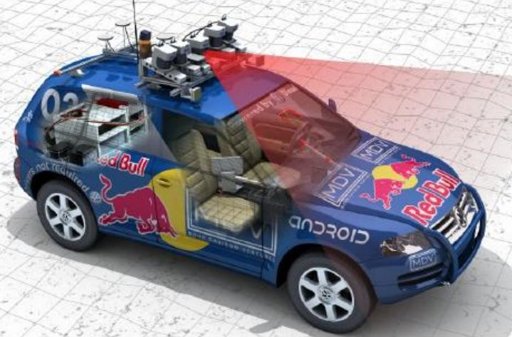

# VISION - Image  

## An attempt to the Codalab [Vision Challenge](https://codalab.lri.fr/competitions/111)  

*Unmodified intro file*
---

This is the Vision project. Since the end of the 20th century, autonomous 
vehicles  have  been  debated  within  the  scientific community. One of the issue raised are the behavior of the vehicule 
which depend of the obstacle. In this challenge, we will study 
the preliminary stage of the Decision, ie the classification of detected entities          
(by the cameras of the vehicle for example).  To illustrate this problematic, 
we propose to study the image source CIFAR-10 which groups entities that 
can interact with the vehicle environment like animals(cat,  horse,  dog,  ...)  
and vehicles (bike, car, truck, ...).                 

Credits:
Vincent Boyer, Warren Pons, Ludovic Kun, Qixiang PENG

Prerequisites:
Install Anaconda Python 2.7, including jupyter-notebook

Usage:

(1) If you are a challenge participant:

- The file README.ipynb contains step-by-step instructions on how to create a sample submission for the Vision challenge. At the prompt type:
  `jupyter-notebook README.ipynb`

- Download the public\_data and replace the sample\_data with it.

- Modify sample\_code\_submission to provide a better model.

- Zip the contents of sample\_code\_submission (without the directory, but with metadata) to create a submission to the challenge.

- Alternatively, to create a sample result submission run:

  `python ingestion_program/ingestion.py public_data sample_result_submission ingestion_program sample_code_submission`

- Zip the contents of sample\_result\_submission (without the directory).

(2) If you are a challenge organizer and use this starting kit as a template, ensure that:

- you modify README.ipynb to provide a good introduction to the problem and good data visualization

- sample\_data is a small data subset carved out the challenge TRAINING data, for practice purposes only (do not compromise real validation or test data)

- the following programs run properly

    `python ingestion_program/ingestion.py sample_data sample_result_submission ingestion_program sample_code_submission`

    `python scoring_program/score.py sample_data sample_result_submission scoring_output`

- IMPORTANT: if you switch between sample data, remove xxx\_model.pickle from sample\_code\_submission, otherwise you'll have inconsistent data and models.

- the metric identified by metric.txt in the utilities directory is the metric used both to compute performances in README.ipynb and for the challenge. To use your own metric, change my\_metric.py.
